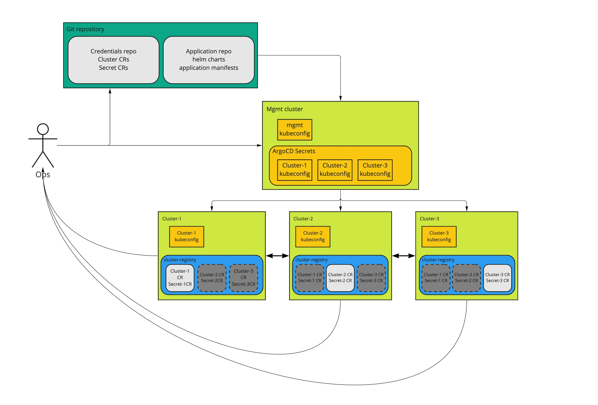
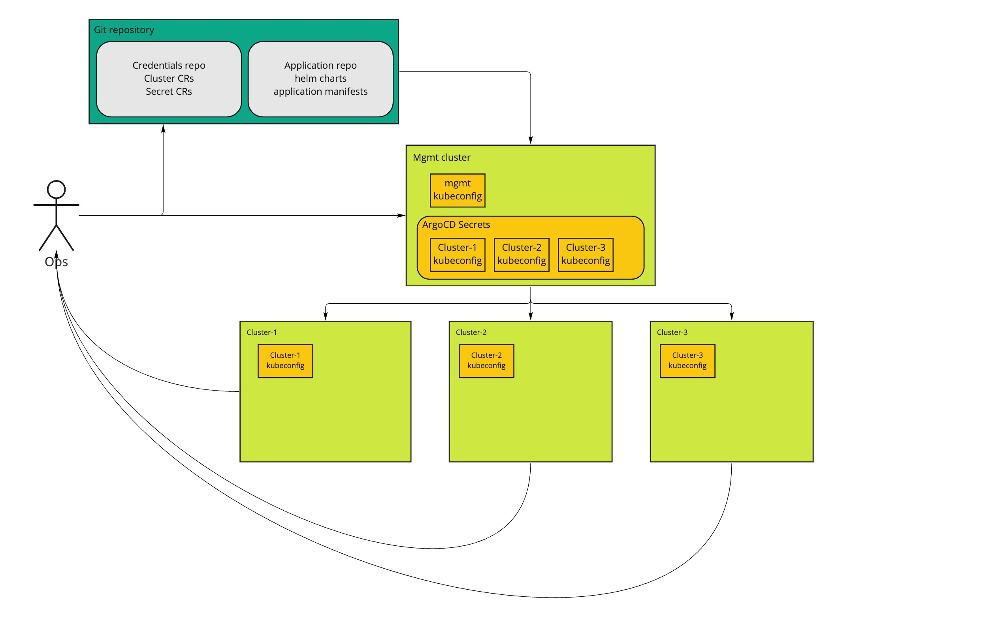
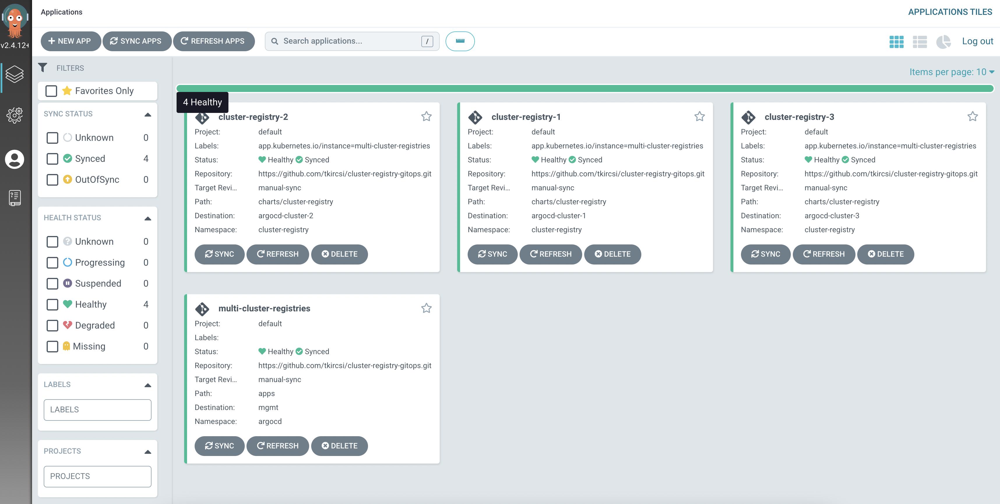
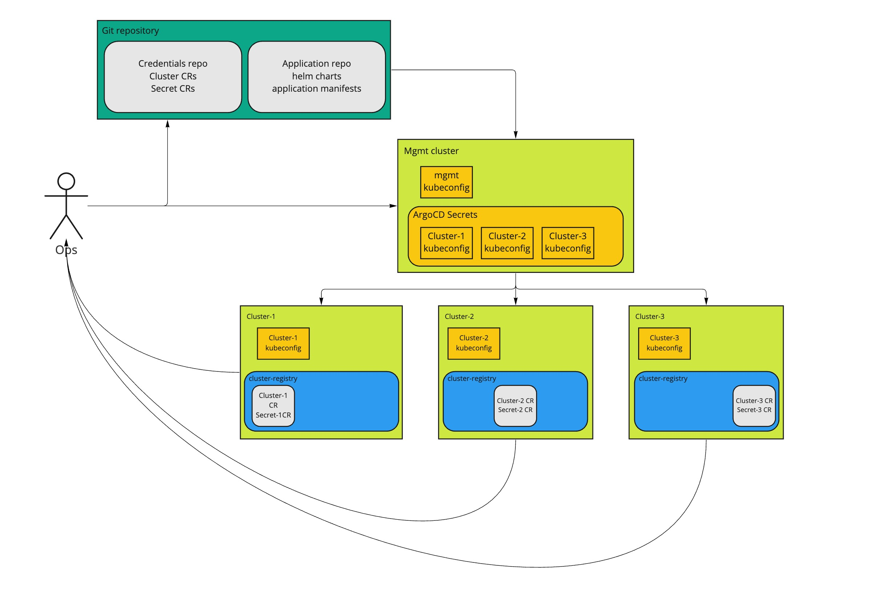

# GitOps
This guide details how to set up a GitOps based development environment for multi-cluster cluster-registry applications. This is the high level architecture for Argo CD that will be demonstrated in this guide.



# Prerequisites

- Kubernetes clusters
  - argocd-mgmt (management cluster)
  - argocd-cluster-1
  - argocd-cluster-2
  - argocd-cluster-3
- Install Argo CD
  - Install Argo CD Server
  - Install Argo CD CLI
  - Register clusters
- Prepare Git repository
- Install SMM


# Install Argo CD

Check kubernetes contexts
```bash
kubectl config get-contexts

CURRENT   NAME                CLUSTER             AUTHINFO            NAMESPACE
          argocd-cluster-1    argocd-cluster-1    argocd-cluster-1
          argocd-cluster-2    argocd-cluster-2    argocd-cluster-2
          argocd-cluster-3    argocd-cluster-3    argocd-cluster-3
*         argocd-mgmt         argocd-mgmt         argocd-mgmt

```
Make sure the `argocd-mgmt` Kubernetes context is the current-context.
## Install Argo CD Server
```bash
kubectl create namespace argocd
kubectl apply -n argocd -f https://raw.githubusercontent.com/argoproj/argo-cd/stable/manifests/install.yaml

kubectl get pods -n argocd
NAME                                                    READY   STATUS    RESTARTS   AGE
pod/argocd-application-controller-0                     1/1     Running   0          7h59m
pod/argocd-applicationset-controller-78b8b554f9-pgwbl   1/1     Running   0          7h59m
pod/argocd-dex-server-6bbc85c688-8p7zf                  1/1     Running   0          16h
pod/argocd-notifications-controller-75847756c5-dbbm5    1/1     Running   0          16h
pod/argocd-redis-f4cdbff57-wcpxh                        1/1     Running   0          7h59m
pod/argocd-repo-server-d5c7f7ffb-c8962                  1/1     Running   0          7h59m
pod/argocd-server-76497676b-pnvf4                       1/1     Running   0          7h59m
```
For the Argo CD UI set the ```argocd-server service``` type to ```LoadBalancer```.
```bash
kubectl patch svc argocd-server -n argocd -p '{"spec": {"type": "LoadBalancer"}}'
```
Check the ```EXTERNAL-IP``` address of the ```argocd-server service```.
```bash
kubectl get svc -n argocd

NAME                                      TYPE           CLUSTER-IP      EXTERNAL-IP   PORT(S)                      AGE
argocd-applicationset-controller          ClusterIP      10.108.6.106    <none>        7000/TCP,8080/TCP            7d13h
argocd-dex-server                         ClusterIP      10.108.1.67     <none>        5556/TCP,5557/TCP,5558/TCP   7d13h
argocd-metrics                            ClusterIP      10.108.7.191    <none>        8082/TCP                     7d13h
argocd-notifications-controller-metrics   ClusterIP      10.108.4.120    <none>        9001/TCP                     7d13h
argocd-redis                              ClusterIP      10.108.3.81     <none>        6379/TCP                     7d13h
argocd-repo-server                        ClusterIP      10.108.2.194    <none>        8081/TCP,8084/TCP            7d13h
argocd-server                             LoadBalancer   10.108.14.130   EXTERNAL-IP   80:31306/TCP,443:30063/TCP   7d13h
argocd-server-metrics                     ClusterIP      10.108.11.82    <none>        8083/TCP                     7d13h
```
Get the inital password for the ```admin``` user
```bash
kubectl -n argocd get secret argocd-initial-admin-secret -o jsonpath="{.data.password}" | base64 -d; echo
```
Login to the Argo CD server using the https://EXTERNAL-IP url.

## Install Argo CD CLI
More detailed installation instructions can be found via the CLI installation documentation. (https://argo-cd.readthedocs.io/en/stable/cli_installation/)

Login Using The CLI
```bash
argocd login <EXTERNAL-IP>
```
For more details about Argo CD installation please follow the [ArgoCD getting started guide](https://argo-cd.readthedocs.io/en/stable/getting_started/) 

## Register clusters
```bash
argocd cluster add argocd-cluster-1
argocd cluster add argocd-cluster-2
argocd cluster add argocd-cluster-3

argocd cluster list
SERVER                          NAME              VERSION  STATUS   MESSAGE                                                  PROJECT
https://CLUSTER-2-IP            argocd-cluster-2           Unknown  Cluster has no applications and is not being monitored.
https://CLUSTER-3-IP            argocd-cluster-3           Unknown  Cluster has no applications and is not being monitored.
https://kubernetes.default.svc  argocd-mgmt                Unknown  Cluster has no applications and is not being monitored.
https://CLUSTER-1-IP            argocd-cluster-1           Unknown  Cluster has no applications and is not being monitored.
```
Clusters also can be added by declaratively as kubernetes secrets, for more details see https://argo-cd.readthedocs.io/en/stable/operator-manual/declarative-setup/#clusters
```yaml
apiVersion: v1
kind: Secret
metadata:
  name: argocd-cluster-1-secret
  labels:
    argocd.argoproj.io/secret-type: cluster
type: Opaque
stringData:
  name: argocd-cluster-1
  server: https://CLUSTER-1-IP
  config: |
    {
      "bearerToken": "<authentication token>",
      "tlsClientConfig": {
        "insecure": false,
        "caData": "<base64 encoded certificate>"
      }
    }
```
## Patch ArgoCD configuration
We need to patch the ArgoCD configuration for working some feature like App of Apps pattern, ignore diffs...
```yaml
# argocd-app-patch-cm.yaml
apiVersion: v1
kind: ConfigMap
metadata:
  name: argocd-cm
  namespace: argocd
  labels:
    app.kubernetes.io/name: argocd-cm
    app.kubernetes.io/part-of: argocd
data:
  # App of app health check
  resource.customizations.health.argoproj.io_Application: |
    hs = {}
    hs.status = "Progressing"
    hs.message = ""
    if obj.status ~= nil then
      if obj.status.health ~= nil then
        hs.status = obj.status.health.status
        if obj.status.health.message ~= nil then
          hs.message = obj.status.health.message
        end
      end
    end
    return hs
  # Ignoring RBAC changes made by AggregateRoles
  resource.compareoptions: |
    # disables status field diffing in specified resource types
    ignoreAggregatedRoles: true
  
    # disables status field diffing in specified resource types
    # 'crd' - CustomResourceDefinition-s (default)
    # 'all' - all resources
    # 'none' - disabled
    ignoreResourceStatusField: all
```
Apply the new configurations
```bash
kubectl apply -f argocd-app-patch-cm.yaml
```
# Prepare Git repository

Create an empty repository called `https://github.com/<your-github-username>/cluster-registry-gitops` on GitHub and initialize it with a README.md so that the repository is cloneable. Because cluster credentials will be stored in this repository, it is recommended to make it private. **It is highly recommended to use one of the secret management tool for production environment!** (Read more about it at https://argo-cd.readthedocs.io/en/stable/operator-manual/ )secret-management/

Obtain a personal access token via https://github.com/settings/tokens, required permissions: 
- admin:org_hook
- admin:repo_hook
- read:org
- read:public_key
- repo

Login with your personal access token with `git`. (https://docs.github.com/en/authentication/keeping-your-account-and-data-secure/creating-a-personal-access-token)

Clone the repository into your local workspace.

```bash
git clone https://github.com/<your-github-username>/cluster-registry-gitops.git
```

Add the Github repository to ArgoCD with `argocd` CLI. You can also add it on ArgoCD Web UI.
```bash
argocd repo add https://github.com/<your-github-username>/cluster-registry-gitops.git --name cluster-registry --username <your-github-username> --password <github-peresonal-access-token>
```

Verify that the repository is connected (Status should be Successful):
```bash
argocd repo list

TYPE  NAME              REPO                                                    INSECURE  OCI    LFS    CREDS  STATUS      MESSAGE  PROJECT
git   cluster-registry  https://github.com/<your-github-username>/cluster-registry-gitops.git  false     false  false  true   Successful
```
Change into the `cluster-registry-gitops` directory and create the structure.
```bash
cd cluster-registry-gitops

mkdir charts apps cluster-secrets main
```
This shows the final structure of the `cluster-registry-gitops` repository.
```bash
.
├── README.md
├── apps
│   ├── cluster-registry-1.yaml
│   ├── cluster-registry-2.yaml
│   └── cluster-registry-3.yaml
├── charts
│   └── cluster-registry
│       ├── Chart.yaml
│       ├── LICENSE
│       ├── README.md
│       ├── crds
│       │   └── ...
│       ├── examples
│       │   └── ...
│       ├── templates
│       │   └── ...
│       └── values.yaml
├── cluster-secrets
│   └── README.md
└── main
    ├── cluster-registries.yaml
    └── cluster-secrets.yaml
```
## Cluster-registry Helm chart
Clone the [cisco-open/cluster-registry-controller](https://github.com/cisco-open/cluster-registry-controller) git repository to outside of the ```cluster-registry-gitops``` folder.
```bash
cd ~/YOUR-WORKSPACE

git clone https://github.com/cisco-open/cluster-registry-controller.git
```
Copy the ```cluster-registry``` chart's folder from  ```cluster-registry-controller/deploy/charts``` to ```cluster-registry-gitops/charts``` folder.
```bash
cp -r cluster-registry-controller/deploy/charts/cluster-registry cluster-registry-gitops/charts
```
## Create cluster-registry ArgoCD Applications
Change to the ```apps``` folder and create the following file for ```cluster-registry-1``` app.
```yaml
# cluster-registry-1.yaml
apiVersion: argoproj.io/v1alpha1
kind: Application
metadata:
  name: cluster-registry-1
  namespace: argocd
  annotations:
    argocd.argoproj.io/sync-wave: "1"
  finalizers:
    - resources-finalizer.argocd.argoproj.io
spec:
  project: default
  source:
    repoURL: https://github.com/<your-github-username>/cluster-registry-gitops.git
    targetRevision: HEAD
    path: charts/cluster-registry
    helm:
      parameters:
        - name: "localCluster.name"
          value: "argocd-cluster-1"
  destination:
    name: argocd-cluster-1
    namespace: cluster-registry
  ignoreDifferences:
    - kind: ValidatingWebhookConfiguration
      group: admissionregistration.k8s.io
      jsonPointers:
      - /webhooks
  syncPolicy:
    automated:
      prune: true
      selfHeal: true
    syncOptions:
      - Validate=false
      - PruneLast=true
      - CreateNamespace=true

# cluster-registry-2.yaml
apiVersion: argoproj.io/v1alpha1
kind: Application
metadata:
  name: cluster-registry-2
  namespace: argocd
  annotations:
    argocd.argoproj.io/sync-wave: "1"
  finalizers:
    - resources-finalizer.argocd.argoproj.io
spec:
  project: default
  source:
    repoURL: https://github.com/<your-github-username>/cluster-registry-gitops.git
    targetRevision: HEAD
    path: charts/cluster-registry
    helm:
      parameters:
        - name: "localCluster.name"
          value: "argocd-cluster-2"
  destination:
    name: argocd-cluster-2
    namespace: cluster-registry
  ignoreDifferences:
    - kind: ValidatingWebhookConfiguration
      group: admissionregistration.k8s.io
      jsonPointers:
      - /webhooks
  syncPolicy:
    automated:
      prune: true
      selfHeal: true
    syncOptions:
      - Validate=false
      - PruneLast=true
      - CreateNamespace=true


# cluster-registry-3.yaml
apiVersion: argoproj.io/v1alpha1
kind: Application
metadata:
  name: cluster-registry-3
  namespace: argocd
  annotations:
    argocd.argoproj.io/sync-wave: "1"
  finalizers:
    - resources-finalizer.argocd.argoproj.io
spec:
  project: default
  source:
    repoURL: https://github.com/<your-github-username>/cluster-registry-gitops.git
    targetRevision: HEAD
    path: charts/cluster-registry
    helm:
      parameters:
        - name: "localCluster.name"
          value: "argocd-cluster-3"
  destination:
    name: argocd-cluster-3
    namespace: cluster-registry
  ignoreDifferences:
    - kind: ValidatingWebhookConfiguration
      group: admissionregistration.k8s.io
      jsonPointers:
      - /webhooks
  syncPolicy:
    automated:
      prune: true
      selfHeal: true
    syncOptions:
      - Validate=false
      - PruneLast=true
      - CreateNamespace=true
```
Change to the ```main``` folder and create the main Application for cluster-registry applications.
```yaml
# cluster-registries.yaml
apiVersion: argoproj.io/v1alpha1
kind: Application
metadata:
  name: multi-cluster-registries
  namespace: argocd
  finalizers:
    - resources-finalizer.argocd.argoproj.io
spec:
  project: default
  source:
    repoURL: https://github.com/<your-github-username>/cluster-registry-gitops.git
    targetRevision: HEAD
    path: apps
  destination:
    namespace: argocd
    name: argocd-mgmt
  syncPolicy:
    automated:
      prune: true
      selfHeal: true
    retry:
      limit: 5
      backoff:
        duration: 5s
        maxDuration: 3m0s
        factor: 2
    syncOptions:
      - Validate=false
      - PruneLast=true
      - CreateNamespace=true
```
## Instal cluster-registry applications with ArgoCD
We have all the parts that need to install the cluster-registry applications on our three kubernetes clusters. This picture shows the current status.



The next step is apply the ```main/cluster-registry.yaml``` ArgoCD App of Apps on the ```argocd-mgmt``` cluster. Change to the root directory of the git repository and run the following commands.
```bash
kubectl apply -f main/cluster-registry.yaml
application.argoproj.io/multi-cluster-registries created

```
After a couple of seconds check the applications from the terminal 
```bash
argocd app list

NAME                      CLUSTER           NAMESPACE         PROJECT  STATUS  HEALTH   SYNCPOLICY  CONDITIONS  REPO                                                    PATH                     TARGET
cluster-registry-1        argocd-cluster-1  cluster-registry  default  Synced  Healthy  Auto-Prune  <none>      https://github.com/<your-github-username>/cluster-registry-gitops.git  charts/cluster-registry  manual-sync
cluster-registry-2        argocd-cluster-2  cluster-registry  default  Synced  Healthy  Auto-Prune  <none>      https://github.com/<your-github-username>/cluster-registry-gitops.git  charts/cluster-registry  manual-sync
cluster-registry-3        argocd-cluster-3  cluster-registry  default  Synced  Healthy  Auto-Prune  <none>      https://github.com/<your-github-username>/cluster-registry-gitops.git  charts/cluster-registry  manual-sync
multi-cluster-registries  mgmt              argocd            default  Synced  Healthy  Auto-Prune  <none>      https://github.com/<your-github-username>/cluster-registry-gitops.git  apps                     manual-sync
```
or on ArgoCD Admin UI.



Three independent cluster-registry app are installed on three cluster, but they do not trust each outher. The current architecture is



## Build trust between cluster-registry applications
To create trust between each cluster-registry, we need to share the Cluster CR and Secret CR along them. 
```bash
# check Cluster and Secret CR of cluster-registry-1
kubectl --context argocd-cluster-1 get cluster -o wide
NAME               ID                                     STATUS   TYPE    SYNCED   VERSION             PROVIDER   DISTRIBUTION   REGION         STATUS MESSAGE   SYNC MESSAGE
argocd-cluster-1   bb11ad03-7010-4d31-9120-6b5e8c4209b6   Ready    Local            v1.22.12-gke.2300   google     GKE            europe-west1

kubectl --context argocd-cluster-1 -n cluster-registry get secrets
NAME                                               TYPE                                    DATA   AGE
argocd-cluster-1                                   k8s.cisco.com/cluster-registry-secret   1      12m
cluster-registry-1-controller-reader-token-g67xw   kubernetes.io/service-account-token     3      13m
cluster-registry-1-controller-token-465h7          kubernetes.io/service-account-token     3      13m
default-token-l2pmd                                kubernetes.io/service-account-token     3      3d1h
```
We have both ```argocd-cluster-1``` Cluster and Secret objects. 
## Export clusters and secrets and push them into Git repository
Create the ```export-secrets.sh``` script in the root folder of the repository and run to pull the Cluster and Secret objects and store them in the local folder ```cluster-secrets/base```.
```bash
# export-secrets.sh
set -e

kubectl --context argocd-cluster-1 get cluster argocd-cluster-1 -o yaml > ./cluster-secrets/base/argocd-cluster-1.yaml
kubectl --context argocd-cluster-1 -n cluster-registry get secrets argocd-cluster-1 -o yaml > ./cluster-secrets/base/argocd-secret-1.yaml

kubectl --context argocd-cluster-2 get cluster argocd-cluster-2 -o yaml > ./cluster-secrets/base/argocd-cluster-2.yaml
kubectl --context argocd-cluster-2 -n cluster-registry get secrets argocd-cluster-2 -o yaml > ./cluster-secrets/base/argocd-secret-2.yaml

kubectl --context argocd-cluster-3 get cluster argocd-cluster-3 -o yaml > ./cluster-secrets/base/argocd-cluster-3.yaml
kubectl --context argocd-cluster-3 -n cluster-registry get secrets argocd-cluster-3 -o yaml > ./cluster-secrets/base/argocd-secret-3.yaml

echo "Exporting cluster and secrets CRs successfully."
```
Save the file, make it executable and run it.
```bash
chmod +x export-secrets.sh

./export-secrets.sh
```
If script run successfully, the Cluster and Secrets are exported into ```cluster-secrets/base``` folder. Next is to push them into Git repository. Change to the root of your repo folder and
```bash
git add .

git commit -m "update cluster secrets"

git push
```
## Distribute Clsuters, Secrets
Create an ArgoCD ```ApplicationSet``` to distribute Cluster and Secret objects on each cluster.
```yaml
# cluster-secrets.yaml
apiVersion: argoproj.io/v1alpha1
kind: ApplicationSet
metadata:
  name: multi-cluster-secrets
  namespace: argocd
spec:
  generators:
  - list:
      elements:
      - cluster: 'argocd-cluster-1'
      - cluster: 'argocd-cluster-2'
      - cluster: 'argocd-cluster-3'
  template:
    metadata: 
      name: '{{cluster}}-secrets'
      namespace: argocd
    spec:
      project: default
      source:
        repoURL: https://github.com/<your-github-username>/cluster-registry-gitops.git
        targetRevision: HEAD
        path: cluster-secrets/base
      destination:
        namespace: cluster-registry
        name: '{{cluster}}'
      ignoreDifferences:
      - kind: Secret
        group: ""
        jsonPointers:
        - /metadata
      - kind: Cluster
        group: clusterregistry.k8s.cisco.com
        jsonPointers:
        - /metadata
      syncPolicy:
        automated:
          prune: true
          selfHeal: true
        retry:
          limit: 5
          backoff:
            duration: 5s
            maxDuration: 3m0s
            factor: 2
        syncOptions:
          - Validate=false
          - PruneLast=true
          - CreateNamespace=true
```
Apply the ApplicationSet on ```argocd-mgmt``` cluster.
```bash
kubectl apply -f main/cluster-secrets.yaml
```
Check the applications.
```bash
NAME                      CLUSTER           NAMESPACE         PROJECT  STATUS  HEALTH   SYNCPOLICY  CONDITIONS  REPO                                                    PATH                     TARGET
argocd-cluster-1-secrets  argocd-cluster-1  cluster-registry  default  Synced  Healthy  Auto-Prune  <none>      https://github.com/<your-github-username>/cluster-registry-gitops.git  cluster-secrets/base     manual-sync
argocd-cluster-2-secrets  argocd-cluster-2  cluster-registry  default  Synced  Healthy  Auto-Prune  <none>      https://github.com/<your-github-username>/cluster-registry-gitops.git  cluster-secrets/base     manual-sync
argocd-cluster-3-secrets  argocd-cluster-3  cluster-registry  default  Synced  Healthy  Auto-Prune  <none>      https://github.com/<your-github-username>/cluster-registry-gitops.git  cluster-secrets/base     manual-sync
cluster-registry-1        argocd-cluster-1  cluster-registry  default  Synced  Healthy  Auto-Prune  <none>      https://github.com/<your-github-username>/cluster-registry-gitops.git  charts/cluster-registry  manual-sync
cluster-registry-2        argocd-cluster-2  cluster-registry  default  Synced  Healthy  Auto-Prune  <none>      https://github.com/<your-github-username>/cluster-registry-gitops.git  charts/cluster-registry  manual-sync
cluster-registry-3        argocd-cluster-3  cluster-registry  default  Synced  Healthy  Auto-Prune  <none>      https://github.com/<your-github-username>/cluster-registry-gitops.git  charts/cluster-registry  manual-sync
multi-cluster-registries  mgmt              argocd            default  Synced  Healthy  Auto-Prune  <none>      https://github.com/<your-github-username>/cluster-registry-gitops.git  apps                     manual-sync
```
